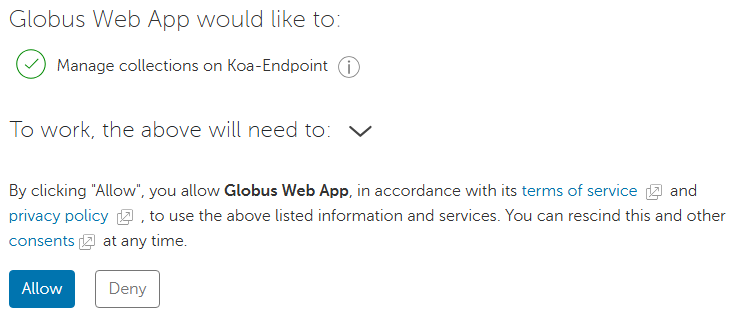
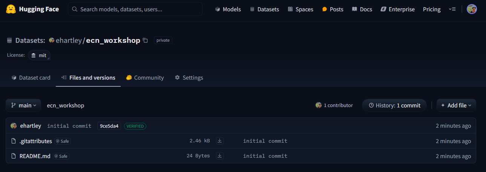

# Workshop: Data Transfers and Documentation

## Summary
The second workshop in this three-part series will focus on best practices for data transfer and management, emphasizing remote transfers and efficient handling of large datasets using high-performance computing. We’ll cover various file transfer methods, including Rclone, Globus, scp, rsync, and wget, along with API usage on Koa. The session will also highlight the importance of open-source project development and documentation, covering version control fundamentals with GitHub and strategies for creating well-structured repositories.

## Data Types, Efficient Storage, and Unique Data Formats
While data format selection is rarely the primary bottleneck, understanding the available options can help optimize performance when needed.

### __Understanding Data Types__
___
Data types define the kind of values stored in a variable, impacting storage efficiency and computational performance. Common data types include:

- __Integer (int)__ – Whole numbers, efficient in memory.
- __Floating-point (float, double)__ – Decimal numbers, consuming more space than integers.
- __String (str, char)__ – Textual data, requiring variable memory.
- __Boolean (bool)__ – True/False values, stored as 1-bit but often take a full byte in practice.
- __Complex (complex)__ – Numbers with real and imaginary parts, used in specialized computations.

In __Python__, data types like lists, dictionaries, and sets allow flexible data manipulation, while __R__ primarily uses vectors, data frames, and factors.

## Efficient Data Storage
Efficient storage techniques reduce memory footprint and improve processing speed:

### __Choosing Optimal Data Types__
___
- Use `int8`, `int16`, `int32`, or `int64` instead of generic `int` where possible.
- Prefer `float32` over `float64` if precision requirements are moderate.
- Use categorical data types (`category` in pandas) for repetitive string values.

### __Compressed Data Formats__
___
- Storing data in compressed formats (e.g., `.gzip`, `.bz2`) reduces storage size but may increase read time.

### __Columnar vs. Row-Based Storage__
___
- __Row-based formats (CSV, JSON, SQL tables)__ are efficient for transactional workloads.
- __Columnar formats (Parquet, ORC)__ are ideal for analytical queries, enabling efficient compression and retrieval.

### __Sparse Data Representation__
___
- Sparse matrices (used in SciPy and Pandas) help store large datasets with many zero values efficiently.

## Unique Data Formats and Their Uses
Different file formats offer distinct advantages depending on the application.

| Format | Type | Key Features | Common Uses |
|--------|------|-------------|-------------|
| __CSV__ | Row-based | Simple, human-readable, large file sizes | General-purpose data storage, exchange |
| __JSON__ | Row-based | Flexible, hierarchical, human-readable | APIs, web data |
| __Parquet__ | Columnar | Compressed, optimized for large datasets | Big data processing, analytics |
| __ORC__ | Columnar | Optimized for Hadoop, better compression than Parquet | Large-scale data warehousing |
| __HDF5__ | Hierarchical | Supports structured and unstructured data | Scientific computing, high-performance applications |
| __NetCDF (.nc)__ | Multidimensional | Designed for array-based data like climate models | Weather, geospatial, and oceanographic data |
| __Feather__ | Columnar | Optimized for fast I/O with pandas/R | Data science workflows |
| __Avro__ | Row-based | Schema evolution support, binary storage | Streaming and distributed systems |
| __Excel (.xlsx, .xls)__ | Row-based | Widely used, supports formulas, multiple sheets | Business, finance, simple data storage |
| __RData (.rda, .rds)__ | Binary | Efficient storage for R objects | Storing and reloading R-specific data |
| __Stata (.dta)__ | Row-based | Designed for statistical software, supports metadata | Social sciences, econometrics |

## Choosing the Right Format
Efficient data storage and selection of the right file format improve performance and usability, ensuring smooth data handling across different applications.

- Use __Parquet or ORC__ for analytical queries on large datasets.
- Use __HDF5 or NetCDF__ for scientific and multidimensional data.
- Use __JSON__ for nested and semi-structured data.
- Use __CSV__ only when interoperability is the top priority, as it's inefficient for large datasets.
- Use __Excel__ when working with business users who require familiar file formats.
- Use __RData__ for efficient storage of R objects.
- Use __Stata__ when working within Stata’s statistical analysis ecosystem.

## Using `tar` and `zip/unzip` for File Compression and Extraction in the Linux CLI

### __Introduction__

In this guide, we'll cover how to use the `tar` command for compressing and extracting files, as well as how to work with `.zip` files using the `zip` and `unzip` commands. These are commonly used tools for managing large datasets in Linux environments.
- While compression can reduce file size, it's best to avoid storing extremely large files. Instead, break data into smaller, more manageable chunks that can be efficiently loaded and merged when needed.


### __1. Using `tar` for Compression and Extraction__

#### __1.1. Compressing Files and Directories with `tar`__

The `tar` (tape archive) command is used to combine multiple files and directories into a single archive file. This can also compress the archive using different compression formats.

#### __Create a `tar` archive__

```bash
tar -cvf archive_name.tar /path/to/directory_or_file
```

- `-c` stands for "create."
- `-v` enables verbose mode (shows the progress).
- `-f` specifies the filename of the archive.

#### __Example:__

```bash
tar -cvf data_archive.tar /home/user/data
```

This creates a `tar` archive called `data_archive.tar` from the `/home/user/data` directory.

#### __Create a compressed `tar.gz` archive__

You can compress the archive using `gzip` by adding the `-z` flag.

```bash
tar -czvf archive_name.tar.gz /path/to/directory_or_file
```

#### __Example:__

```bash
tar -czvf data_archive.tar.gz /home/user/data
```

This creates a `tar.gz` archive called `data_archive.tar.gz` from the `/home/user/data` directory.

#### __Create a compressed `tar.bz2` archive__

Alternatively, you can use `bzip2` compression by adding the `-j` flag.

```bash
tar -cjvf archive_name.tar.bz2 /path/to/directory_or_file
```

#### __1.2. Extracting Files from a `tar` Archive__

#### __Extract a `tar` archive__

To extract a `.tar` file:

```bash
tar -xvf archive_name.tar
```

- `-x` stands for "extract."

#### __Example:__

```bash
tar -xvf data_archive.tar
```

This extracts the contents of `data_archive.tar` in the current directory.

#### __Extract a `tar.gz` or `tar.bz2` archive__

To extract a compressed `.tar.gz` archive:

```bash
tar -xzvf archive_name.tar.gz
```

For `.tar.bz2` archives:

```bash
tar -xjvf archive_name.tar.bz2
```

#### __Extract to a specific directory__

You can specify a directory to extract to using the `-C` option:

```bash
tar -xzvf archive_name.tar.gz -C /path/to/extract/directory
```

---

### __2. Using `zip` and `unzip` for Compression and Extraction__

#### __2.1. Compressing Files with `zip`__

The `zip` command is used to compress files into a `.zip` archive.

```bash
zip archive_name.zip /path/to/file_or_directory
```

#### __Example:__

```bash
zip data_archive.zip /home/user/data
```

This creates a `.zip` archive called `data_archive.zip` from the `/home/user/data` directory.

#### __Add multiple files to a zip archive__

You can add multiple files or directories by listing them:

```bash
zip archive_name.zip file1.txt file2.txt /path/to/directory
```

#### __2.2. Extracting Files with `unzip`__

To extract files from a `.zip` archive, use the `unzip` command:

```bash
unzip archive_name.zip
```

#### __Example:__

```bash
unzip data_archive.zip
```

This extracts the contents of `data_archive.zip` in the current directory.

#### __Extract to a specific directory__

You can specify a directory for extraction with the `-d` option:

```bash
unzip archive_name.zip -d /path/to/extract/directory
```

---

### __3. Additional Options__

#### __3.1. List contents of a `tar` archive__

To list the contents of a `tar` archive without extracting it:

```bash
tar -tvf archive_name.tar
```

#### __3.2. List contents of a `.zip` archive__

To list the contents of a `.zip` archive:

```bash
unzip -l archive_name.zip
```

---

## Introduction to Using SQLite and PostgreSQL on a Linux HPC

High-performance computing (HPC) environments often involve processing large datasets efficiently. Using a database system instead of raw files can enhance data storage, retrieval, and query performance. Two common database solutions are __SQLite__ (a lightweight, file-based database) and __PostgreSQL__ (a powerful, scalable client-server database). This guide introduces their usage on a Linux HPC for efficient data storage and querying.

Included below are a few resources for learning SQL. (This is a great use of AI!) 
- [codeacademy](https://www.codecademy.com/catalog/language/sql?g_network=g&g_productchannel=&g_adid=699379052398&g_locinterest=&g_keyword=learn%20sql&g_acctid=243-039-7011&g_adtype=&g_keywordid=kwd-13880240&g_ifcreative=&g_campaign=account&g_locphysical=9195133&g_adgroupid=165097893329&g_productid=&g_source={sourceid}&g_merchantid=&g_placement=&g_partition=&g_campaignid=21287608736&g_ifproduct=&utm_id=t_kwd-13880240:ag_165097893329:cp_21287608736:n_g:d_c&utm_source=google&utm_medium=paid-search&utm_term=learn%20sql&utm_campaign=US_-_Exact&utm_content=699379052398&g_adtype=search&g_acctid=243-039-7011&gad_source=1&gclid=CjwKCAjw-qi_BhBxEiwAkxvbkGkvVjBC_ULnDToTBJPcBoIRLDOMJ1ql_V6mNHugOyDunFpFYyNpGRoCZ3gQAvD_BwE)
- [w3schools](https://www.w3schools.com/sql/sql_where.asp)
- [SQL Basics](https://www.simplilearn.com/tutorials/sql-tutorial/what-is-sql)

## Setting Up SQLite on an HPC
- Best for single-user applications and small-to-medium datasets.
- Does not require a separate server process.
- Stores the entire database in a single file, making it easy to manage.
- Ideal for quick prototyping and local data storage.
  
### __Installation__
Load SQLite on Koa
```bash
module load devel/SQLite
```

### __Creating and Using an SQLite Database__
___
```bash
sqlite3 my_database.db  # Create or open a database
```
- `example_sqlite.ipynb` illustrates how to create a database from existing csv files and the process of submitting queries via pandas to load data. 

Inside the SQLite prompt:
```sql
# to view the tables in the database
.tables

# to view all databases
.databases

# show the schema of a table
.schema table_name

# exit the database
.exit
```
You can also execute SQL queries from a script:
```bash
sqlite3 my_database.db < my_script.sql
```

More details on sqlite, and a list of commands, can be found [here](https://sqlite.org/cli.html). 

## Setting Up PostgreSQL on an HPC
- Best for multi-user environments and large-scale datasets.
- Supports concurrent access, transactions, and advanced querying.
- Runs as a separate server process, enabling remote connections.
- Provides robust indexing, JSON support, and extensibility.
  
### __Installation and Configuration__
___
Load PostgreSQL on Koa
```bash
module load data/PostgreSQL
```
- There are multiple versions on the cluster (`module load data/PostgreSQL/14.4-GCCcore-11.3.0` and `module load data/PostgreSQL/16.1-GCCcore-13.2.0`). Some databases constructed under one version may be incompatible with the other. 

### __Starting the PostgreSQL Server__
```bash
# Initialize the database cluster
initdb -D /path/to/database/directory

# Start the database server
pg_ctl -D /path/to/database/directory -l logfile start
```

Alternatively, if the server location has already been established:
```bash
# Evaluate the status of the server
pg_ctl status -D /path/to/database/directory

# Alternative ways to start/stop the server
pg_ctl -D /path/to/database/directory stop
pg_ctl -D /path/to/database/directory start

```

### __Creating a Database and User__
```bash
psql postgres  # Enter the PostgreSQL prompt
```
Inside the PostgreSQL prompt:
```sql
CREATE DATABASE my_database;
CREATE USER my_user WITH ENCRYPTED PASSWORD 'securepassword';
GRANT ALL PRIVILEGES ON DATABASE my_database TO my_user;
```
To exit:
```bash
\q
```

### __Accessing the PostgreSQL Database__
```bash
psql -U my_user -d my_database -h localhost
```
Or execute SQL from a script:
```bash
psql -U my_user -d my_database -f my_script.sql
```
- `example_postgresql.ipynb` illustrates how to access your PostgreSQL database and load data into a pandas dataframe. 


- Build and extract data from an SQLite database. (`example_sqlite.ipynb`)
- Build and extract data from a PostgreSQL server. (`example_postgresql.ipynb`)

# Moving Data Using SCP, SFTP, and Rsync

This document provides a guide on transferring files and directories between local and remote machines using `scp`, `sftp`, and `rsync`. It includes examples and explanations of various use cases. __Remember__, when moving data between your local machine and Koa, you will almost always be running the below commands in your local terminal and not on Koa. 

## SCP - Secure Copy

`scp` (Secure Copy) is a command-line tool used to transfer files between a local machine and a remote machine over SSH (Secure Shell). To use `scp`, the remote server must be running an SSH server.

> __Important__: If the remote server is Koa, be aware that you will receive an automatic DUO push to your primary authentication option.
> 
> __Note__: If transferring large files, it may be beneficial to use the data transfer nodes on Koa. To do so, simply use `<username>@koa-dtn.its.hawaii.edu`.

### Syntax
`scp` can be used to either push or pull data. Below are the commands for each use case. For more details on `scp`, refer to the [manual page](https://linux.die.net/man/1/scp).

#### Pulling Data

To pull data from a remote server to your local machine, use the following syntax:

```bash
scp [<username>@koa.its.hawaii.edu:][path to file on Koa] [path to where to save file on local]
```

Example:

```bash
# '.' indicates the directory you are currently in 
scp <username>@koa.its.hawaii.edu:test/file . 
```

This command downloads the file `file` from the directory `test` on `<username>@koa.its.hawaii.edu` and places it in the current directory on the local machine.

#### Pushing Data

To push data from your local machine to a remote server, use the following syntax:

```bash
scp [path to where to save file on local] [<username>@koa.its.hawaii.edu:][path to file on Koa]
```

Example:

```bash
scp file <username>@koa.its.hawaii.edu:test/
```

This command uploads the file `file` from your local machine to `<username>@koa.its.hawaii.edu` and places it in the remote directory `test`.

### Transferring Directories

To transfer entire directories, use the `-r` flag for recursion. Below are the commands for pulling and pushing directories.

#### Pulling a Directory

```bash
scp -r [<username>@koa.its.hawaii.edu:][path to directory on Koa] [path to where to save directory on local]
```

Example:

```bash
scp -r <username>@koa.its.hawaii.edu:test .
```

This command downloads the entire directory `test` from `<username>@koa.its.hawaii.edu` and places it in the current directory on your local machine.

#### Pushing a Directory

```bash
scp -r [path to where to save directory on local] [<username>@koa.its.hawaii.edu:][path to directory on Koa]
```

Example:

```bash
scp -r test2 <username>@koa.its.hawaii.edu:test/
```

This command uploads the entire directory `test2` from your local machine to `<username>@koa.its.hawaii.edu` and places it inside the remote directory `test`.

---

## Rsync

Rsync is a powerful tool for synchronizing files and directories, both locally and remotely. Here's a concise guide covering its key features and common use cases.
- For more information on `rsync`, refer to the [manual page](https://linux.die.net/man/1/rsync).

## Basic Usage: Local Synchronization

*   __`rsync -r dir1/ dir2`__:  Recursively copies the *contents* of `dir1` to `dir2`. The trailing slash is important.
*   __`rsync -a dir1/ dir2`__:  A recommended option.  `a` stands for "archive" and preserves permissions, timestamps, symbolic links, and more. Again, the trailing slash is important.
*   __`rsync -a dir1 dir2`__:  Copies the `dir1` directory *itself* into `dir2`, creating `dir2/dir1/[files]`.  Without the trailing slash, the directory `dir1` will be created inside `dir2`.

__Key Takeaway:__ The trailing slash on the source directory (`dir1/`) determines whether you're syncing the directory's *contents* or the directory *itself*.

## Dry Runs

*   __`rsync -anv dir1/ dir2`__:  A dry run.  `-n` (or `--dry-run`) simulates the sync without making changes.  `-v` (verbose) provides detailed output.  Use this to preview what rsync will do.

## Remote Synchronization (Over SSH)

Requires SSH access and rsync installed on both machines.

*   __Push (Local to Remote):__
    `rsync -a ~/dir1 <username>@koa.its.hawaii.edu:destination_directory`  (No trailing slash here to copy the directory itself.)
*   __Pull (Remote to Local):__
    `rsync -a <username>@koa.its.hawaii.edu:/home/<username>/dir1 place_to_sync_on_local_machine`

__Remember:__ Source is always the first argument, destination is the second.

## Useful Options

*   __`-z`__:  Compresses data during transfer, improving speed for uncompressed files (e.g., text).  `rsync -az source destination`
*   __`-P`__:  Combines `--progress` (shows a progress bar) and `--partial` (allows resuming interrupted transfers).  `rsync -azP source destination`
*   __`--delete`__:  Deletes files from the destination that no longer exist in the source.  Use with caution.  Always do a dry run first.  `rsync -an --delete source destination` (dry run)
*   __`--exclude=pattern`__: Excludes files or directories matching `pattern`.
*   __`--include=pattern`__: Overrides exclusions for files matching `pattern`.  Use this after the `--exclude` option. `rsync -a --exclude=pattern_to_exclude --include=pattern_to_include source destination`
*   __`--backup --backup-dir=/path/to/backups`__: Creates backups of files before they are overwritten in the destination.  `rsync -a --delete --backup --backup-dir=/path/to/backups /path/to/source destination`

## Best Practices

*   __Always double-check your arguments, especially the trailing slash.__
*   __Use `-n` (dry run) to preview the effects before running any potentially destructive commands, particularly when using `--delete`.__
*   __Consider using `-a` for most synchronization tasks to preserve file attributes.__
*   __Use `-P` to monitor progress, especially for large transfers.__

---

## SFTP

`SFTP` (Secure File Transfer Protocol) is another option for transferring files over SSH. It provides an interactive interface and supports operations like uploading, downloading, and file management.

```bash
sftp <username>@koa.its.hawaii.edu
```

Once connected, you can use the following commands within the `sftp` prompt:
- `get [filename]` – Download a file
- `put [filename]` – Upload a file
- `ls` – List files in the current directory
- `cd [directory]` – Change directory
- `exit` – Close the connection

For more information on `sftp`, refer to the [manual page](https://linux.die.net/man/1/sftp). 

---


## Rclone: Connecting Koa \& Google Drive 


Supplemental setup guides can be found [here](https://rclone.org/drive/) and [here](https://uhawaii.atlassian.net/wiki/spaces/HPC/pages/9339075/rclone).
- Login to the data transfer node (dtn) (you could also do this from the login nodes at <username>@koa.its.hawaii.edu)
  
```
[user@localhost ~]$ ssh user@koa-dtn.its.hawaii.edu
user@koa-dtn.its.hawaii.edu's password:

Duo two-factor login for user
Enter a passcode or select one of the following options:
1. Duo Push to XXX-XXX-xxxx
2. Phone call to XXX-XXX-xxxx
Passcode or option (1-1): 1

Pushed a login request to your device...
Success. Logging you in...

Last login: Fri Mar 5 06:14:19 UTC 2021 on pts/2
[user@koa-dtn ~]$

```

- Verify rclone is availble and see the list of available commands
  
```
[user@koa-dtn ~]$ which rclone 
/usr/bin/rclone

[user@koa-dtn ~]$ rclone
Usage:
  rclone [flags]
  rclone [command]

Available commands:
  about       Get quota information from the remote.
...
```

-Initial Setup of rclone with Google Drive
```
[user@koa-dtn ~]$  rclone config
No remotes found - make a new one
n) New remote
s) Set configuration password
q) Quit config
n/s/q> n

name> uh_gdrive

Option Storage.
Type of storage to configure.
Choose a number from below, or type in your own value.
 1 / 1Fichier
   \ (fichier)
 2 / Akamai NetStorage
   \ (netstorage)
 3 / Alias for an existing remote
   \ (alias)
 4 / Amazon S3 Compliant Storage Providers including AWS, Alibaba, ArvanCloud, Ceph, ChinaMobile, Cloudflare, DigitalOcean, Dreamhost, GCS, HuaweiOBS, IBMCOS, IDrive, IONOS, LyveCloud, Leviia, Liara, Linode, Magalu, Minio, Netease, Outscale, Petabox, RackCorp, Rclone, Scaleway, SeaweedFS, Selectel, StackPath, Storj, Synology, TencentCOS, Wasabi, Qiniu and others
   \ (s3)
 5 / Backblaze B2
   \ (b2)
 6 / Better checksums for other remotes
   \ (hasher)
 7 / Box
   \ (box)
 8 / Cache a remote
   \ (cache)
 9 / Citrix Sharefile
   \ (sharefile)
10 / Cloudinary
   \ (cloudinary)
11 / Combine several remotes into one
   \ (combine)
12 / Compress a remote
   \ (compress)
13 / Dropbox
   \ (dropbox)
14 / Encrypt/Decrypt a remote
   \ (crypt)
15 / Enterprise File Fabric
   \ (filefabric)
16 / FTP
   \ (ftp)
17 / Files.com
   \ (filescom)
18 / Gofile
   \ (gofile)
19 / Google Cloud Storage (this is not Google Drive)
   \ (google cloud storage)
20 / Google Drive
   \ (drive)
21 / Google Photos
   \ (google photos)
22 / HTTP
   \ (http)
23 / Hadoop distributed file system
   \ (hdfs)
24 / HiDrive
   \ (hidrive)
25 / ImageKit.io
   \ (imagekit)
26 / In memory object storage system.
   \ (memory)
27 / Internet Archive
   \ (internetarchive)
28 / Jottacloud
   \ (jottacloud)
29 / Koofr, Digi Storage and other Koofr-compatible storage providers
   \ (koofr)
30 / Linkbox
   \ (linkbox)
31 / Local Disk
   \ (local)
32 / Mail.ru Cloud
   \ (mailru)
33 / Mega
   \ (mega)
34 / Microsoft Azure Blob Storage
   \ (azureblob)
35 / Microsoft Azure Files
   \ (azurefiles)
36 / Microsoft OneDrive
   \ (onedrive)
37 / OpenDrive
   \ (opendrive)
38 / OpenStack Swift (Rackspace Cloud Files, Blomp Cloud Storage, Memset Memstore, OVH)
   \ (swift)
39 / Oracle Cloud Infrastructure Object Storage
   \ (oracleobjectstorage)
40 / Pcloud
   \ (pcloud)
41 / PikPak
   \ (pikpak)
42 / Pixeldrain Filesystem
   \ (pixeldrain)
43 / Proton Drive
   \ (protondrive)
44 / Put.io
   \ (putio)
45 / QingCloud Object Storage
   \ (qingstor)
46 / Quatrix by Maytech
   \ (quatrix)
47 / SMB / CIFS
   \ (smb)
48 / SSH/SFTP
   \ (sftp)
49 / Sia Decentralized Cloud
   \ (sia)
50 / Storj Decentralized Cloud Storage
   \ (storj)
51 / Sugarsync
   \ (sugarsync)
52 / Transparently chunk/split large files
   \ (chunker)
53 / Uloz.to
   \ (ulozto)
54 / Union merges the contents of several upstream fs
   \ (union)
55 / Uptobox
   \ (uptobox)
56 / WebDAV
   \ (webdav)
57 / Yandex Disk
   \ (yandex)
58 / Zoho
   \ (zoho)
59 / iCloud Drive
   \ (iclouddrive)
60 / premiumize.me
   \ (premiumizeme)
61 / seafile
   \ (seafile)
Storage> 20

Option client_id.
Google Application Client Id
Setting your own is recommended.
See https://rclone.org/drive/#making-your-own-client-id for how to create your own.
If you leave this blank, it will use an internal key which is low performance.
Enter a value. Press Enter to leave empty.
client_id>

```
- For optimal performance, follow the guide below the create your own client id [here](https://rclone.org/drive/#making-your-own-client-id).
  - The official rclone guide to making your own client id is a bit out of date but can be found [here](https://rclone.org/drive/). The guide below is just an updated version of this guide. 
1) Log into the [Google API Console](https://console.developers.google.com/) with your Google account. It doesn't matter what Google account you use. (It need not be the same account as the Google Drive you want to access)


2) Create a new project by clicking the left of the search bar at the top of the page then clicking "New project"


3) Click to the left of the search bar and select the project you just created. Then click on the Google Cloud logo in the upper left corner of the browser.


4) Select APIs & Services then select "Enable APIs and services"


5) Search "Drive" and enable "Google Drive API"


6) Click "Credentials" in the left-side panel 


7) Select "Configure consent screen" in the upper right. Then select get started and enter the required information. Enter "rclone" for the "App name" and your email for the "User support email". Select "External" for the "Audience". Enter your own email under "Contact Information". Then agree to the terms and select create.


8) Select "Data Access" in the left-side panel and click "Add or remove scopes". Paste "https://www.googleapis.com/auth/docs,https://www.googleapis.com/auth/drive,https://www.googleapis.com/auth/drive.metadata.readonly" into the "Manually add scopes" box and select "Add to table". Then select "Update" and click "Save".


9) Select "Audience" in the left-side panel and add your email to "Test users"


10) Select "Clients" in the left-side panel and select "Create client". Select "Destop app" as the Application type and leave the default name. Then select create. 


11) Download the JSON of your OAuth client and copy the client ID and Client secret to Notepad (we will use this momentarily). 

12) Select "Audience" from the left-side panel and click "Publish app". Exit Google Cloud and return to the command line setup of rclone. 

```
client_id> provide the client_id you copied earlier

Option client_secret.
OAuth Client Secret.
Leave blank normally.
Enter a value. Press Enter to leave empty.
client_secret> provide the client_secret you copied earlier

Option scope.
Comma separated list of scopes that rclone should use when requesting access from drive.
Choose a number from below, or type in your own value.
Press Enter to leave empty.
 1 / Full access all files, excluding Application Data Folder.
   \ (drive)
 2 / Read-only access to file metadata and file contents.
   \ (drive.readonly)
   / Access to files created by rclone only.
 3 | These are visible in the drive website.
   | File authorization is revoked when the user deauthorizes the app.
   \ (drive.file)
   / Allows read and write access to the Application Data folder.
 4 | This is not visible in the drive website.
   \ (drive.appfolder)
   / Allows read-only access to file metadata but
 5 | does not allow any access to read or download file content.
   \ (drive.metadata.readonly)
scope> 1

Option service_account_file.
Service Account Credentials JSON file path.
Leave blank normally.
Needed only if you want use SA instead of interactive login.
Leading `~` will be expanded in the file name as will environment variables such as `${RCLONE_CONFIG_DIR}`.
Enter a value. Press Enter to leave empty.
service_account_file>

Edit advanced config?
y) Yes
n) No (default)
y/n> n

Use web browser to automatically authenticate rclone with remote?
 * Say Y if the machine running rclone has a web browser you can use
 * Say N if running rclone on a (remote) machine without web browser access
If not sure try Y. If Y failed, try N.

y) Yes (default)
n) No
y/n> n
```
The final verification of rclone requires you to run the command provided in the CLI on your local machine with access to an internet browser. 
- For windows users, install rclone locally using the below command then run the command from the setup process. This will prompt you to sign in to your Google account then will provide a key to copy and paste as the `config_token`. 
```
# Install rclone locally
winget Rclone.Rclone
```

- For mac users, install rclone locally using the below command then run the command from the setup process. This will prompt you to sign in to your Google account then will provide a key to copy and paste as the `config_token`. 
```
# Install rclone locally
brew install rclone
```

```
Configure this as a Shared Drive (Team Drive)?

y) Yes
n) No (default)
y/n> n

Keep this "uh_gdrive" remote?
y) Yes this is OK (default)
e) Edit this remote
d) Delete this remote
y/e/d> y
```

## __Using Rclone__

Listing Files
```
rclone lsf uh_gdrive:

rclone lsf uh_gdrive:Data/
```

Transfering Files
- Copy to Google Drive
```
rclone copy test uh_gdrive:test
```

- Download a Directory from Google Drive
```
rclone copy uh_gdrive:Data Data
```

A beginner's guide to rclone can be found [here](https://blog.cosmicqbit.dev/rclone-a-beginners-guide) and official documentation can be found [here](https://rclone.org/docs/). 

## __Using Globus__

Globus is a secure, high-performance data transfer and management service commonly used in research computing environments. It allows users to transfer large datasets efficiently between institutional storage systems, personal computers, and cloud platforms.

Key Features:
- Reliable High-Speed Transfers: Optimized for moving large datasets quickly and securely.
- Automated Transfers: Supports scheduled and recurring transfers.
- Globus Connect: Enables data movement to and from personal computers.
- Integration with HPC & Storage Systems: Works with clusters, supercomputers, and cloud storage.
- Data Sharing: Allows sharing of files with collaborators without needing to move them.
- Authentication & Access Control: Uses federated identity management for secure access.

### __Globus on Koa__
___
The easiest way to use Globus on Koa is through the [Open OnDemand](https://koa.its.hawaii.edu/pun/sys/dashboard/) File Explorer: steps for which are provided below. For more information on Globus on Koa, see documentation [here](https://uhawaii.atlassian.net/wiki/spaces/HPC/pages/459833388/Globus+on+Koa).
1) Access the "Files" tab in the upper left corner of OOD.


2) Select the "Globus" tab in the upper right corner of the browser.


3) Log in to Globus using the organizational login and select "University of Hawaii"


4) Using the right side panel, you can now upload, donwload, transfer, or share data via Globus.


   
    - You may receive the below message. You will have to allow access to transfer any data. 



# Downloading Data with wget and curl

## Introduction
When working with data, you often need to download files from the internet. Two widely used command-line tools for this purpose are `wget` and `curl`. Both allow you to retrieve files from URLs, but they have different capabilities and syntaxes.

## Using wget
`wget` is a non-interactive command-line utility that downloads files from the web. It supports recursive downloads, resuming downloads, and downloading multiple files.

### Basic Syntax
```bash
wget [options] [URL]
```

### Examples
- __Download a file:__
  ```bash
  wget https://example.com/file.csv
  ```
- __Download multiple files:__
  ```bash
  wget -i urls.txt
  ```
  *(Where `urls.txt` contains a list of URLs to download)*
- **Resume an interrupted download:**
  ```bash
  wget -c https://example.com/largefile.zip
  ```
- __Download a website recursively:__
  ```bash
  wget -r https://example.com
  ```

## Using curl
`curl` is a versatile tool that supports a wide range of protocols, including HTTP, HTTPS, FTP, and SFTP. Unlike `wget`, it does not support recursive downloading but is commonly used for API interactions and more flexible data transfers.

### Basic Syntax
```bash
curl [options] [URL]
```

### Examples
- __Download a file and save it with a specific name:__
  ```bash
  curl -o file.csv https://example.com/file.csv
  ```
- __Follow redirects when downloading:__
  ```bash
  curl -L -o file.csv https://example.com/redirected-file.csv
  ```
- __Resume a download:__
  ```bash
  curl -C - -o largefile.zip https://example.com/largefile.zip
  ```
- __Download multiple files using multiple `curl` commands:__
  ```bash
  curl -O https://example.com/file1.csv -O https://example.com/file2.csv
  ```

## Choosing Between wget and curl
| Feature         | wget  | curl  |
|---------------|------|------|
| Recursive download | ✅ | ❌ |
| Resume downloads  | ✅ | ✅ |
| Supports multiple protocols | ❌ (mostly HTTP, HTTPS, FTP) | ✅ (HTTP, HTTPS, FTP, SFTP, SCP, etc.) |
| API interactions | ❌ | ✅ |
| Ease of use for simple downloads | ✅ | ✅ |

## Conclusion
Both `wget` and `curl` are powerful tools for downloading data. If you need to recursively download a website or resume downloads easily, `wget` is a better choice. If you need more flexibility, such as working with APIs or handling different protocols, `curl` is the preferred tool.
- Note that some websites may have retrieval limits. If the website/database provides examples for `curl` or `wget`, you are probably fine, otherwise be careful if you are calling this a large number of times – there is likely documentation for what is acceptable. In general, I would not be worried if you are not submitting 100+ requests.


- NBER Data (`example_wget_nber.ipynb`)
- Data.Gov Archive (Harvard Law Library) (`example_wget_datagov.ipynb`)
- NASA CM Data (`example_wget_nasa.ipynb`)

# Project Documentation & GitHub

## What is GitHub?

[GitHub](https://github.com) is a platform for hosting, managing, and collaborating on code and research projects. It is built on **Git**, a version control system that tracks changes to files over time, making it easier to manage project history, experiment safely, and collaborate effectively.

On GitHub, you can:

- **Store code** in repositories (often called "repos")
- **Track changes** with commits and branches
- **Collaborate** with others using pull requests and code reviews
- **Manage issues and bugs** with built-in tools
- **Publish documentation** using README files and GitHub Pages

## Why Use GitHub?  

GitHub offers several key benefits that make it invaluable for software development, research, and data management:  

### **1. Version Control & Change Tracking**  
GitHub allows you to track every change made to a project using **commits** (snapshots of your work). This ensures:  
- **No more lost progress**—you can always revert to an earlier version.  
- **Full transparency**—you can see who made what changes and when.  
- **Safe experimentation**—you can test ideas on separate branches without affecting the main project.  

### **2. Repositories (Repos) for Organizing Work**  
A **repository** is where your project is stored. It includes:  
- **Code and data**: Scripts, models, datasets, and supporting files.  
- **Documentation**: A `README.md` file that describes the project.  
- **Commit history**: A complete log of all changes.  
- **Collaboration tools**: Branching, pull requests, and issue tracking.  

Repositories can be **public** (open to everyone) or **private** (restricted to specific users).  

### **3. Collaboration & Code Review**  
GitHub enables efficient teamwork through:  
- **Branches**: Isolate new work to prevent conflicts before merging changes.  
- **Pull Requests (PRs)**: A structured way to propose, review, and approve changes before integrating them.  
- **Code Reviews**: Team members can comment on proposed changes to ensure quality before merging.  

*Note: this isn't particularly relevant for individuals who want to use GitHub to track their personal work. 

### **4. Issue Tracking & Project Management**  
GitHub includes built-in tools for organizing and managing projects:  
- **Issues**: Track bugs, feature requests, and research questions.  
- **Labels & Milestones**: Categorize tasks and set deadlines.  
- **Project Boards**: Use Kanban-style boards to visualize progress.  

### **5. Searchability & Documentation**  
GitHub makes it easy to **search** your own code and past work:  
- Find specific keywords across all files in a repository.
  - The search bar allows you to search the current repositories for any keywords. For example, the image below would search the `HPC-in-Econ-Basics` repository for any occurence of the word "Koa". You could also search with a user or orgs GitHub profile which is included as the second image below. 
  
  


- Use **GitHub Copilot** to assist in searching and refining code.
  - Copilot can be accessed by selecting the dropdown located next to the search bar in the upper right corner.
    

- Keep detailed notes in `README.md` files, wikis, and project pages.  

### **6. Open-Source & Transparent Research**  
- Encourages **reproducible science** by sharing replication materials.  
- Increases **credibility** and impact, particularly in interdisciplinary fields.  
- Makes it easier for others to **extend and build upon** your research.  

## Using GitHub for Research & Replication  

GitHub is an excellent platform for sharing **comprehensive replication materials** for published work. Repositories should be **self-contained**, providing clear instructions so others can fully reproduce your results using only the included documentation.  

Beyond replication, GitHub is useful for **documenting ongoing projects** by providing a structured way to track progress and maintain clarity. **README files** serve as a space to capture notes, workflow details, and key explanations, ensuring that important context isn’t lost. Using **private repositories**, you can keep detailed records of your current work before making them public. Regularly updating your repository allows you to log the project’s evolution, making it easier to compile a clean, final version when needed.  

## Getting Started  

To begin using GitHub, follow these basic steps:

1. **Create a GitHub account**  
   Visit [GitHub.com](https://github.com) and sign up for a free account. This will give you access to create repositories, contribute to others’ projects, and more.  

2. **Install GitHub Desktop**  
   While you can use Git through the command line, many people prefer the **GitHub Desktop** app, which provides a graphical user interface (GUI) for Git. Download it from [GitHub Desktop](https://desktop.github.com/download/) and follow the installation instructions. This is an easy and intuitive way to interact with Git and GitHub, and you don’t need to use the command line if you don't want to.
   - Instead, this is going to allow you to manage your GitHub repositories as files on your local machine through the File Explorer. 

4. **Create and Clone Repositories**  
   - To start a new project, you can **create a repository** through GitHub Desktop or the website. This will allow you to store your code, documentation, and other files in one place. The most challenging aspect of creating a "Public" repository is selecting the correct license. Guides on license options can be found [here](https://docs.github.com/en/repositories/managing-your-repositorys-settings-and-features/customizing-your-repository/licensing-a-repository) and [here](https://medium.com/@avinashvagh/github-licenses-explained-a-quick-guide-46d98ef4ca81). (If the intention is to keep the repository "Private", you do not need to select a license.) 
     - Using GitHub.com:
       1) Select the "+" icon in the upper right side of the browser and select "New repository"
       

       2) Fill out the information for "Repository name", whether you would like the repo to be "Public" or "Private", and select your preferred license. Then select "Create repository".
       

     - Using GitHub Desktop:
       1) Select "File" in the upper left corner the select "New Repository".
       

       2) Fill out the information for "Name" and select your preferred license.
       

       3) Selecting "Publish repository" will publish the repo on GitHub.com. (I believe the default is to publish as a "Public" repository.) 
       


   - If you want to contribute to, or just create a copy of, an existing project, you can **clone a repository** from GitHub to your local machine or Koa. 
     - Cloning to Koa using the command line:
       1) To clone a repo, first navigate to the main page of the repo.
       

       2) Select the green button that says "Code" and select the "Local" tab.
       

       3) Select HTTPS and copy the web URL. Then run the command below.
       

       ```bash
       # Note: on Koa, you can only clone repositories when attached to a compute node.
       # The login nodes do not support git.

       # If the command below does not work, you may have to load git using: module load tools/git
       
       git clone https://github.com/EthanHartley22/HPC-in-Econ-Basics.git
       ```
     
     - Cloning locally using GitHub Desktop:
       1) To clone a repo, first navigate to the main page of the repo.
       

       2) Select the green button that says "Code" and select the "Local" tab.
       

       3) Select "Open with GitHub Desktop" and follow the prompts to launch GitHub Desktop. Within GitHub Desktop, click the blue "Clone" button.
          
       


5. **Making Changes: Commit, Push, and Pull**  
   - **Commit**: When you make changes to a file in your project, you’ll **commit** those changes in GitHub Desktop. A commit is like a snapshot of your work at a given point. You can add a message to describe what changes were made.
     - Within GitHub Desktop, you will see a list of changes to any new/existing files in the current repository. If you were to add a new file called "Add_New_File.txt" to your repo, you would see the below message.
       
       

     - This message just means that there have been changes to the files on your local versions of the repository. To sync with GitHub.com and store your changes, you first need to "Commit to main" by adding a commit message and description, then selecting the blue "Commit to main" button.
       
       

   - **Push**: After committing your changes locally, you can **push** them to GitHub. This uploads your changes to your GitHub repository, making them available to others (or just for your backup).
     - After clicking the "Commit to main" button, you will see the "Push origin" option now has a gray indicator with an arrow that point upwards. Clicking this button will sync your changes with the repository on GitHub.com.
       
       

   - **Pull**: If someone else has made changes to the repository (if you’re working on a team), you can **pull** the latest updates from GitHub to your local copy. This ensures that you’re always working with the most up-to-date version of the project.
     - On GitHub Desktop, this will appear as "Fetch origin" located in the same area as the "Push origin" button following a commit.
       
       

     - If you have made changes to the repository that are not reflected in the local version, it is best to "Fetch Origin" to sync the two before trying to push any new files/versions. 

  - **GitHub.com**: In addition to GitHub Desktop, you can upload and edit files directly on GitHub.com by selecting the "Add file" dropdown and the pencil icon above the document you would like to edit.
    
    
    

## Personal Portfolios on GitHub

GitHub is an excellent platform not only for version control but also for hosting your personal portfolio. With the help of tools like **Techfolios** and **Jekyll**, you can showcase your projects, research, and accomplishments in a professional and interactive way.

### Techfolios
**Techfolios** offers a straightforward way to create an academic or professional portfolio using GitHub Pages. It provides a variety of customizable templates to get you started, and you can easily [clone these templates](https://github.com/techfolios) to tailor the design to fit your personal style. Documentation and setup guides are available on the [Techfolios website](https://techfolios.github.io/), making it easy for you to create a portfolio that stands out.

### Examples of Portfolios
If you see a portfolio style you like, you can check out the GitHub repositories behind the templates for inspiration and even adapt the code to your own needs.

- [Nick Ai's Portfolio](https://nick-ai.github.io/)
- [Ari Bunnell's Portfolio](https://aribunnell.github.io/)
- [Linnea Wolniewicz's Portfolio](https://linneawolniewicz.github.io/)
- [Ethan Hartley's Portfolio](https://ethanhartley22.github.io/)
- [Peter J. Sadowski's Portfolio](https://peterjsadowski.github.io/)


## Storing Data in Huggingface
[Hugging Face](https://huggingface.co/) is a leading open-source platform for machine learning, specializing in natural language processing (NLP) and deep learning models. It provides an extensive library of pre-trained models through the Transformers library, which supports frameworks like PyTorch and TensorFlow. Hugging Face also offers tools like Datasets for streamlined data processing, Tokenizers for efficient text preprocessing, and Accelerate for distributed training.

Beyond its libraries, Hugging Face hosts the Model Hub, where users can share and deploy models across various domains, including text, audio, and computer vision. __It also allows users to host datasets__, making it easy to store, share, and access large-scale datasets for training and evaluation. Unlike GitHub, which imposes a 100MB file size limit on free accounts, Hugging Face provides a free hosting option for large datasets as long as they are made publicly available—offering an alternative to paid GitHub storage, Google Drive, or Box.


### __Guide to Hosting a Dataset on Hugging Face__

1) After making your free account, nagivate to your profile by clicking the icon in the upper right corner of the browser.


2) Once you select your profile, you should see a screen similar to the picture below. This will show you all of your models/datasets and whether they are currently private/public. 


3) To create a new dataset, select "New Dataset" from the profile drop down menu and provide the dataset name and the corresponding license. 


4) You can now update the "dataset card" (which is similar to the ReadMe.md file in a GitHub repository) and upload data.
  - Data can be upload using `git` via the command line or using the `huggingface_hub` library in Python.

  - If your data is stored locally, you can upload files directly under the "Files and versions" tab by selecting the "Add file" dropdown and selecting "upload files". 

  - Remember to provide detailed commit messages before selecting "Commit changes to `main`". 

